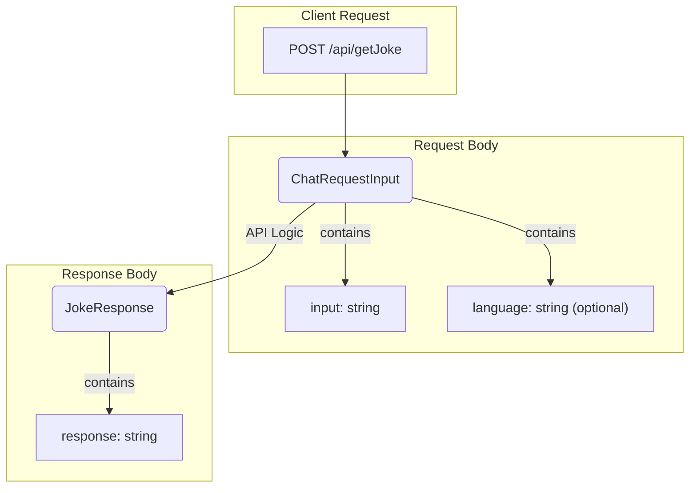

# Joke Web API

This is a simple ASP.NET 8 Web API that generates jokes using Azure OpenAI Service.

## Features

- A single endpoint `/api/getJoke` that accepts a POST request.
- Integrates with Azure OpenAI to generate jokes based on a predefined system prompt.
- Supports configuration via `appsettings.json` and environment variables.
- Includes Swagger/OpenAPI documentation.
- Provides a `Dockerfile` for containerization.

## Prerequisites

- [.NET 8 SDK](https://dotnet.microsoft.com/download/dotnet/8.0)
- [Docker](https://www.docker.com/products/docker-desktop/) (optional, for containerized deployment)

## Configuration

The application uses the **Azure OpenAI Service** to generate jokes. It requires you to provide credentials for your own Azure OpenAI resource.

These can be configured in two ways:

### 1. appsettings.json

Fill in the `AzureOpenAI` section in the `JokeWebApp/appsettings.json` file with the endpoint and key from your Azure OpenAI resource:

```json
{
  "AzureOpenAI": {
    "Endpoint": "YOUR_AZURE_OPENAI_ENDPOINT",
    "ApiKey": "YOUR_AZURE_OPENAI_API_KEY",
    "ModelDeploymentName": "jester" // Optional, defaults to "jester"
  }
}
```

### 2. Environment Variables

You can provide the configuration via environment variables. This is the recommended approach for production and Docker deployments. The double underscore `__` is used as a separator for nested keys.

- `AzureOpenAI__Endpoint`: The endpoint URL for your Azure OpenAI service.
- `AzureOpenAI__ApiKey`: The API key for your Azure OpenAI service.
- `AzureOpenAI__ModelDeploymentName`: The name of the model deployment to use (optional).

## How to Run

### Locally with .NET CLI

1.  Navigate to the project directory: `cd JokeWebApp`
2.  Run the application:
    ```bash
    dotnet run
    ```
3.  The API will be available at `http://localhost:<port>`, and the Swagger UI at `http://localhost:<port>/swagger`.

### With Docker

1.  **Build the image:**
    From the root directory (`joke-web`), run:
    ```bash
    docker build -t joke-api .
    ```

2.  **Run the container:**
    Replace the placeholder values with your actual Azure credentials.
    ```bash
    docker run -d -p 8080:8080 \
      -e AzureOpenAI__Endpoint="https://your-azure-endpoint.com" \
      -e AzureOpenAI__ApiKey="YOUR_SECRET_API_KEY" \
      --name joke-api-container \
      joke-api
    ```
3.  The API will be available at `http://localhost:8080`.

## API Usage

Send a POST request to the `/api/getJoke` endpoint.

**Request Body:**

```json
{
  "input": "Any text here",
  "language": "English"
}
```

**Note:** The `language` field is optional. Supported languages are `Ukrainian`, `English`, and `Polish`. If the field is omitted or if an unsupported language is specified, the API will default to `Ukrainian`.

**Example with cURL:**

```bash
cURL -X POST http://localhost:8080/api/getJoke \
-H "Content-Type: application/json" \
-d '{"input": "Розкажи жарт", "language": "Ukrainian"}'
```

**Success Response (200 OK):**

```json
{
  "response": "Чому програмісти плутають Хелловін та Різдво? Тому що 31 OCT = 25 DEC."
}
```

## API Schema

This diagram illustrates the flow of a request to the API, including the structure of the request and response models.


